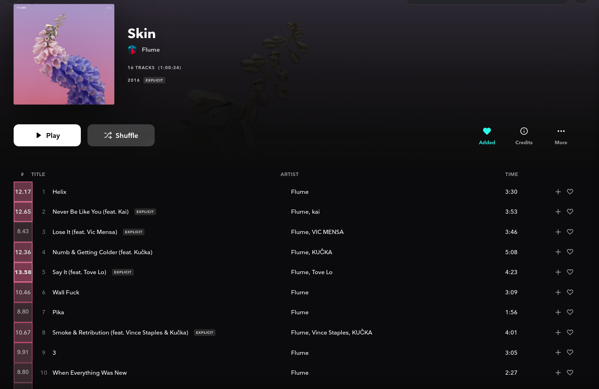

# tridonn
A PyTorch NN trained to recognize songs I might like based on Spotify listening history. This repo also includes [tridonn-extension](tridonn-extension), a Firefox extension for Tidal enabling personalized song ratings on-the-fly.

### Demo [tridonn-extension](tridonn-extension)



### Sample inference output

```
Infering with tridonn on my_fun_playlist.csv
Song ratings: [0-1]
Top 5:
0.24409: 3670232 - Passion Pit - Manners - Sleepyhead
0.24289: 35410166 - Galantis - Runaway (U & I) - Runaway (U & I)
0.23303: 74886176 - Portugal. The Man - Woodstock - Tidal Wave
0.23302: 85108589 - Digitalism - Zdar C1u6 - Holograms
0.23219: 198746918 - Die Antwoord - Donker Mag - Strunk

Bottom 5:
0.17112: 49812280 - Jean-Michel Jarre - Houston - Lyon 1986 - Ethnicolor
0.16992: 75194843 - Arcade Fire - Funeral - Neighborhood #1 (Tunnels)
0.16778: 58990512 - Radiohead - OK Computer - Paranoid Android
0.16217: 55391583 - Pink Floyd - A Foot in the Door- The Best of Pink Floyd - Comfortably Numb
0.11376: 205001701 - funkadelic - Maggot Brain - Maggot Brain
```

### To train

1. get complete Spotify listening history and move into `MyData`
2. run `procRatingsEndsongs.py` to guess rating and select subset of songs
3. clone [fschimd56/EfficientAT](https://github.com/fschmid56/EfficientAT)
4. copy `better_infer.py` into `EfficientAT` and run from there
5. copy back analyzed `.csv` into this folder and run `procNameChange.py`
6. can now start training using `tridonn.ipynb`

### To infer

(only once you have `_synth.csv` and a target `.csv` to rate)
1. run `infer.py`

### To run Tidal inference server

1. once you have a `tridonn` model
2. clone [fschimd56/EfficientAT](https://github.com/fschmid56/EfficientAT)
3. copy `serve_infer.py` into `EfficientAT` and customize server configuration
4. (optional) copy pre-analyzed inference `.csv` to `EfficientAT` folder
5. run `serve_infer.py` from the created folder

### To run Tidal inference extension (tridonn-extension)

1. Follow your browser's instructions for installation

(for Firefox, go into `about:debugging`, select `Load temporary add-on...`, and finally select the `manifest.json`)
